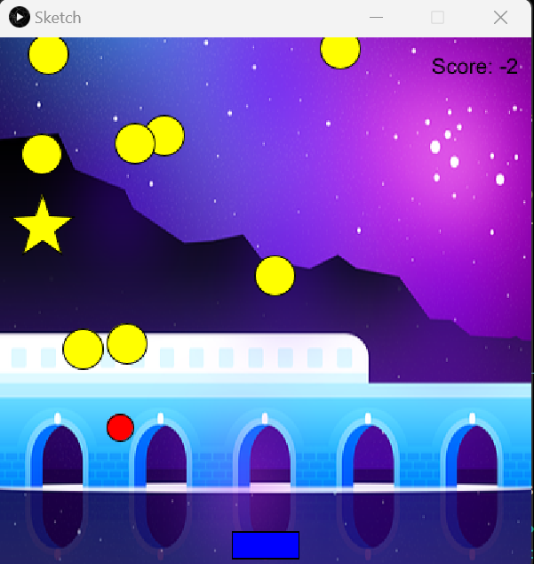

# RectaCatch: Red Dot Challenge

Put your program description here.
This game is designed for people who want to play individual games but don't want to spend too much time. Also, this game doesn't keep a history, so it's a great memory saver for your phone or computer.

In this dynamic game, your objective is to skillfully collect red dots cascading from the top of the screen. The challenge lies in guiding these red dots through a constantly moving blue rectangle situated at the bottom of the screen. However, be cautious and swift, as yellow dots pose a threat and must be skillfully avoided. To keep things exciting, yellow stars make sporadic appearances, serving as bonus points to boost your score. Remember, each collected red dot contributes 1 point to your score, while yellow stars generously add 2 points.

The game is ingeniously designed without a predetermined endpoint, allowing you to play endlessly until your reflexes are tested to their limit. The deciding factor for your success is avoiding missing a red dot or colliding with a yellow dot, signaling the end of your thrilling journey.

At the beginning of the game, you will be asked to choose a speed and you can enter any number. The number you enter will be your initial speed, which will increase over the course of the game. The longer you play, the faster you get!

